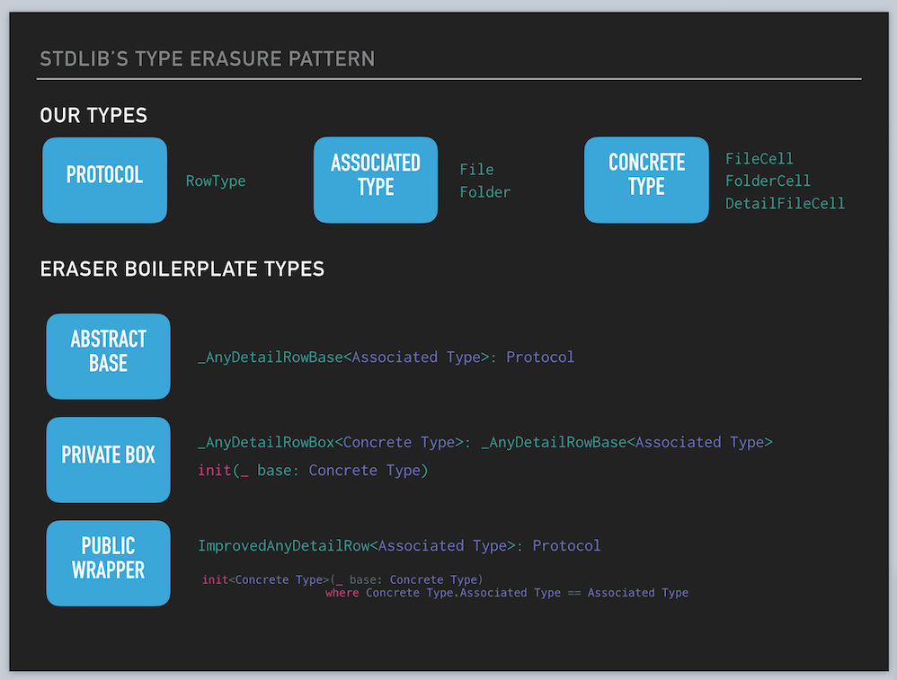
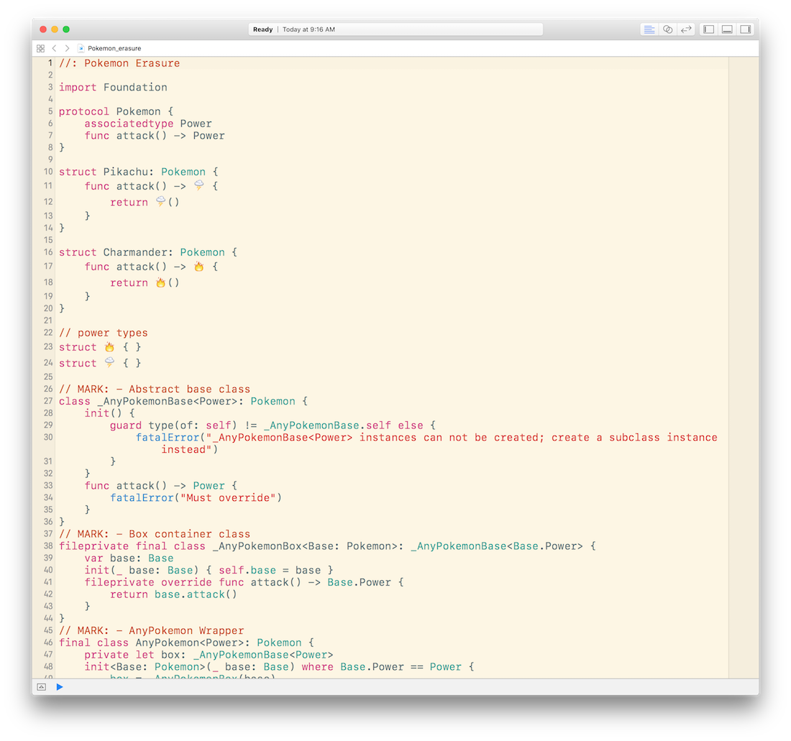

# Type Erasure in the CoreDataStack

Playground examples and slides to accompany 2016 Swift Summit talk on Type Erasure usage in the [CoreDataStack](https://github.com/bignerdranch/coredatastack).

## Playgrounds

[Type Erasure Example from Slide Deck](./playgrounds/Type_Erasure_Slides.playground)

[Type Erasure Example from CoreDataStack](./playgrounds/CoreDataStack_TypeErasure.playground)

[Type Erasure with Pokémon](./playgrounds/Pokemon_erasure.playground)

